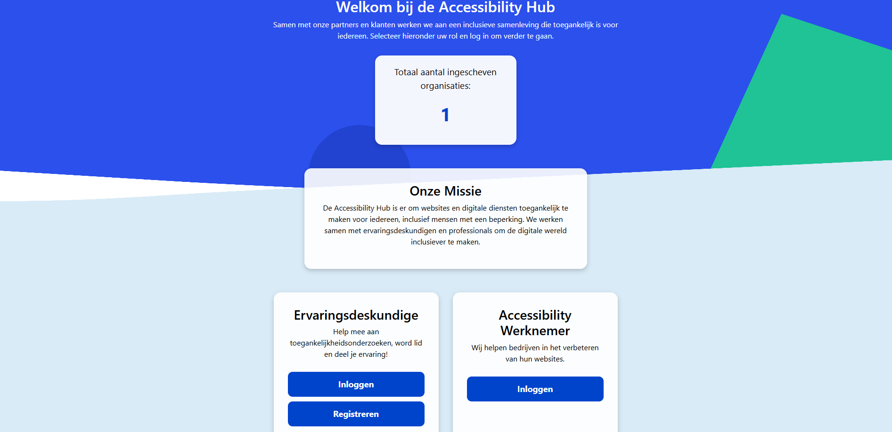
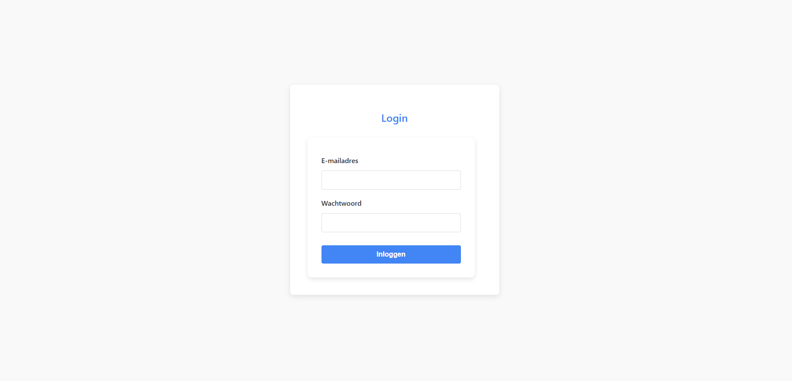
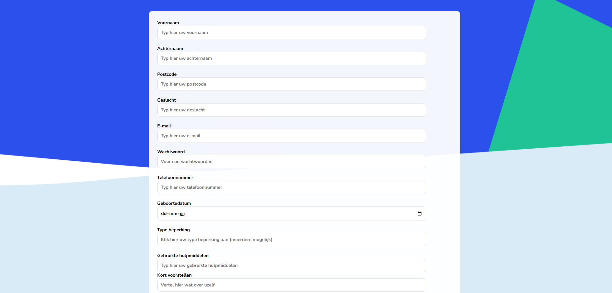
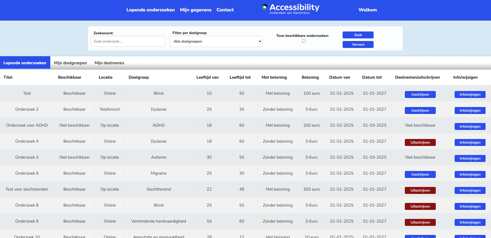
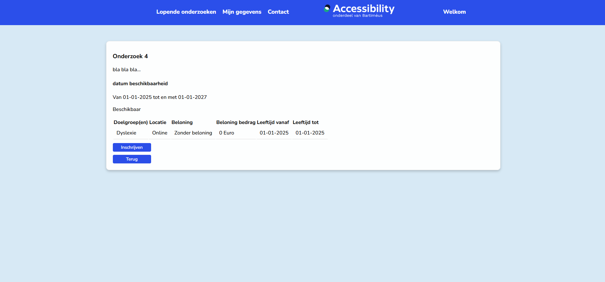

> ### Guide: Accessibility Hub

---

#### Download de pakketten en maak venv file aan

Stap 1: Download de pakketten en maak de venv file staan in de README.md
Stap 2: Run de FLASK (applicatie-wp2), rechts bovenin uitvouwen en dan de play knop indrukken  
Stap 3: Open de server bij Run of klik hier: http://127.0.0.1:5000  
Stap 4: Volgt hieronder  

Bij problemen van het openen kun je altijd http://127.0.0.1:5000 + /(naam van de website) proberen

---

#### Homepage

* Ga via de homepage naar het inlogscherm of de registratie pagina.
* Je kunt hier ook inloggen naar de dashboard (beheerder)

[Homepage](http://127.0.0.1:5000)

---

#### Inlog scherm

Vul hier de inlognaam in + het wachtwoord:

Kies uit 1 van de onderstaande om de website te testen, tip: gebruik een admin.
* Ervaringsdeskundigen: naam = j@email.com , wachtwoord = test123

* Wil je registreren? Dat kan maar de beheerder moet jou wel accepteren (jijzelf)

---

#### registratie scherm

* Maak hier je account aan en accepteer deze via de ervaringsdeskundige dashboard.
* Klik op de voorwaarden om de voorwaarden van onze website te bekijken.

---

#### Lopende onderzoeken scherm

* Je ziet nu een lijst met alle onderzoeken staan
* Je kan maar één filter per keer gebruiken helaas, maar de filters werken wel
* Je kan de tabbladen selecteren en naar Mijn doelgroepen of Mijn deelnames gaan  
* Mijn doelgroepen: Gefilterd op al jouw doelgroepen (soms zie je je doelgroep niet staan, omdat er maar 1 naam bij staat, bij info zie je meer doelgroepen)
* Mijn deelnamen: Gefilterd op al jouw deelnames, makkelijk en overzichtelijk

* buttons:
* deelnemen = Neem deel aan de doelgroep die je klikt (back + refresh pagina)
* uitschrijven = Je bent al ingeschreven en nu schrijf je je uit (back + refresh pagina)
* niet beschikbaar = Je bent niet ingeschreven en het onderzoek is niet meer beschikbaar
* info/wijzigen = Linkt naar de informatie over de geklikte onderzoek

* Zoek uit de pagina nummers, dit kan ook wanneer de zoekopdracht is gefilterd.

* Deze pagina's werken alleen als je ingelogd bent!
[Lopende onderzoeken](http://127.0.0.1:5000/lopende_onderzoeken_ervaringsdeskundigen)
[Mijn doelgroepen](http://127.0.0.1:5000/filter_doelgroep_ervaringsdeskundigen)
[Mijn deelnames](http://127.0.0.1:5000/filter_deelnames_ervaringsdeskundigen)  

----

#### info onderzoek scherm:

* Hier zie je informatie over het onderzoek met beschrijving en alle doelgroepen
* Hier kun je ook in en uitschrijven
* buttons:
* deelnemen = Neem deel aan de doelgroep die je klikt (back + refresh pagina)
* uitschrijven = Je bent al ingeschreven en nu schrijf je je uit (back + refresh pagina)
* niet beschikbaar = Je bent niet ingeschreven en het onderzoek is niet meer beschikbaar

[Info & wijzigen onderzoek](http://127.0.0.1:5000/info_onderzoek_ervaringsdeskundigen?onderzoek_id=4)

---

#### profiel scherm:

* Profiel pagina met jouw gegevens (gebruikers_gegevens)
* Wijzigen button voor veranderen van gegevens
* Deze website is helaas niet mooi, ik had er geen tijd meer voor

[Profiel](http://127.0.0.1:5000/profiel_ervaringsdeskundigen)

#### profiel wijzigen scherm:

* Profiel pagina met jouw gegevens (gebruikers_gegevens)
* Wijzigen button voor veranderen van gegevens
* Deze website is helaas niet mooi, ik had er geen tijd meer voor

[Profiel wijzigen](http://127.0.0.1:5000/profiel_ervaringsdeskundigen)